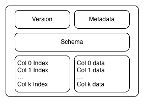
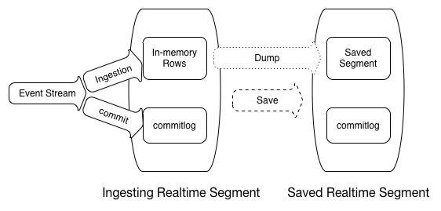
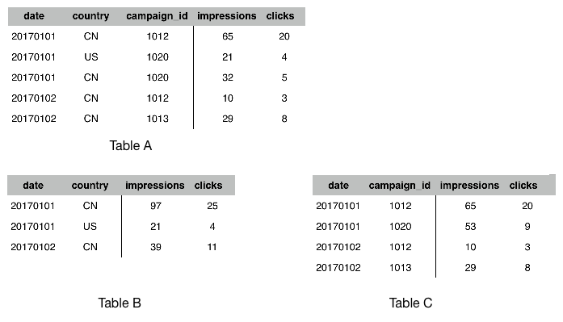
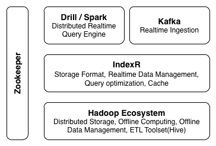
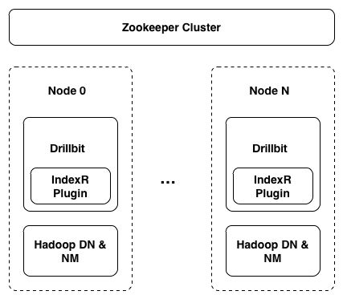

IndexR：实时、可扩展、基于Hadoop的数据仓库
====

## 摘要

IndexR实现了一种可部署于分布式环境，可并行化处理，带索引的，列式的结构化数据格式。基于这种数据格式，IndexR构建了一个数据仓库系统([Data Warehouse](http://baike.baidu.com/view/19711.htm))，它基于HDFS存储，可以对海量数据集做快速统计分析（[OLAP](http://baike.baidu.com/view/22068.htm)），数据可实时导入并且对于查询零延迟。IndexR 为解决大数据场景下分析缓慢、数据延迟、系统复杂等问题而设计。本文描述了IndexR的设计思想，系统架构，以及核心的技术细节。

目前IndexR项目已经开源，项目地址：[https://github.com/shunfei/indexr](https://github.com/shunfei/indexr)。

## 简介

舜飞科技的核心业务之一程序化广告业务，对接全网的各大媒体，每秒产生上百万的分析数据。这些数据对广告投放活动的过程进行了精细的追踪和描述，比如创意的展示量、点击量，活动产生的注册数、回访数等。我们需要对这些数据进行实时分析处理，用于包括客户报告，投放优化，欺诈分析，收费结算等。数据使用者的查询模式是非固定的，无法预测的，并且随着业务量的激增，数据量也急剧增长。我们需要一种新的技术来解决这些需求：

* **超大数据集，低查询延时**。查询模式无法预测，无法预计算；表数据量普遍超过1亿，甚至上百亿千亿，过滤条件有可能会命中大量数据；数据在查询的同时还会有大量的更新，每秒入库几万的数据。要保证较低的查询延时，一般情况下查询延时要求在5s以内，常用高频查询要求1s以内。
* **准实时**。数据从产生到体现在分析结果延时几秒以内。时效性对于某些业务至关重要，并且越实时的数据，价值越大。
* **可靠性，一致性，高可用**。这些数据是公司最重要的数据之一，任何错误和不一致可能会直接体现在客户报表中，对公司的业务和品牌形象产生影响，至关重要。
* **可扩展，低成本，易维护**。业务会快速发展，会产生新的数据源，加入新的表，旧的数据不能删除，这带来巨大的成本压力，和运维压力。典型的更新如加列、列值更新等操作不能影响线上服务，不能带来入库或者查询延迟。
* **SQL支持**。全面支持SQL，要像Mysql一样好用，功能强大。不仅仅支持常见的多维分析，还需要支持复杂的分析查询，如JOIN，子查询等，支持自定义函数(UDF，UDFA)。
* **与Hadoop生态整合**。Hadoop生态的蓬勃发展给大数据处理带来越来越强的处理能力，如果能与它的工具链深度结合，会极大扩展系统的价值。

IndexR是舜飞科技大数据平台组为了应对这些挑战的答案。我们无法在当前的开源产品中找到可以满足所有以上需要的工具。

目前提供相似功能的产品，有些通过使用传统的关系型数据技术，或者通过预先建Cube加速查询。这些方式可能会带来一些问题，比如运维困难，数据量瓶颈，或者模式不够灵活，无法支持业务变化。有些方案使用内存存储技术，使用上成本比较高，而且在大数据分析场景并无特别大的速度优势。近年出现的一些时序数据库，解决了一些入库延迟方面的问题，但是在查询性能，可用性，可扩展性等方面存在一些问题。

IndexR数据仓库系统基于许多优秀的开源产品，并且参考了一些已经存在的工具，精心设计和实现而成。它把数据存放于HDFS，使用Zookeeper在集群中通讯和交涉，使用Hive方便的管理分区数据，可以通过Kafka高速实时导入数据，查询层使用优秀的分布式查询引擎Apache Drill。它的存储和索引设计参考了Infobright社区版和Google Mesa论文，压缩算法借鉴了Infobright，实时入库从HBase和Druid获得启发。

本文从以下几个方面对IndexR进行阐述：

* 存储格式与索引，IndexR的核心模块。
* 实时入库模块，实现快速入库并且查询零延迟。
* 层次结构与部署架构，如何与Hadoop生态系统深度结合。
* 工程实现的问题以及解决方案。
* 典型项目选型。
* 数据仓库在新环境下的挑战，IndexR的意义。

目前在舜飞已经稳定运行，支撑了DSP、网站检测分析等核心业务的实时分析任务，集群每天入库消息300亿+，目前总数据量为千亿级别。

## 存储格式与索引设计

### 数据文件

IndexR存储结构化数据，比如以下是一个虚构的广告投放用户表 Table A:

 column name | data type|
-------------|----------|
`date`       | int      |
`contry`     | string   |
`campaign_id`| long     |
`impressions`| long     |
`clicks`     | long     |

数据文件称为Segment，一个Segment保存一个表的部分行，包含所有的列，如下图。

Segment文件是自解释的，它包含版本信息，完整的表定义，各个部分的元数据(offset)，以及索引。IndexR默认对所有的列进行索引。行顺序可以是入库的自然顺序，也可以是按照用户定义的字段排序。这样的设计可以简化系统架构，不需要额外的元数据存储，非常适合于分布式环境下的并行处理，也方便外部系统如Hive直接使用。

Segment的行数据在内部会进一步细分为pack，每个pack都有独立的索引。pack内部的行数据是以列存储的，即某一列的数据会集中存放在一起。这种方式对于列数据的快速遍历，和压缩带来极大的优势。对于现代通用计算机架构，cache友好，方便vector process，充分发挥现代多核CPU的性能。Segment的列数据使用特别优化的压缩算法，根据数据类型选择不同的算法和参数，通常压缩率10：1以上。

在实际业务数据测试中，IndexR每个节点每秒可以处理1亿个字段。测试机器配置： [Intel(R) Xeon(R) CPU E5-2620 v2 @ 2.10GHz] x 2, 60G RAM, SATA 7200 RPM DISK。这个配置在目前服务器配置中算低端的，更强大的CPU会对IndexR有非常大的性能提升。

### 索引

IndexR采用粗糙集索引(Rough Set Index)，它能以极低的成本，很高的精确度定位到相关文件和位置。

比如我们的某一个数据块（pack）有以下数据，有date（int类型）和use_name（string）类型。

row id |   date   | user_name |
-------|----------|-----------|
0      | 20170101 |  Alice    |
1      | 20170101 |  Bob      |
2      | 20170102 |  Henry    |
3      | 20170107 |  Petter   |
4      | 20170110 |  Mary     |

IndexR对于number和string类型有不同的索引方式，这里描述基本的思路。

对于number类型，会记录该列的最大值（max）,最小值（min），然后把它们的区间(max-min)进行分割成多个区间，每一个区间使用一个bit表示。然后把各个具体的值映射到这个区间之中。

bit |     index chunk   | value |
----|-------------------|-------|
0   | 20170101~20170102 |   1   |
1   | 20170103~20170104 |   0   |
2   | 20170105~20170106 |   0   |
3   | 20170107~20170108 |   1   |
4   | 20170109~20170110 |   1   |

如图，value值为1表示这个区间存在一行或者多行的数据，为0表示不存在。我们只需要存储max，min，和value序列（5个bit）就完成了对这一列的索引。

比如查询

>SELECT `user_name` FROM A WHERE `date` = '20170106'

因为'20170106'属于区间2，value是0，即可以知道'20170106'不存在于这个pack，可以直接跳过。这是一种类似于bloomfilter的过滤方式，索引不命中的pack一定不包含需要的数据

string类型的索引和number类似，不过更加复杂一点。

目前常见的索引有B+树索引，倒排索引，这些索引可以精确定位到具体行，在相对小数据量情况下很有效。这种方式通常没有特别有效的压缩，数据文件大小一般在原始数据的1~3倍之间，当数据量膨胀到一定程度，这类索引的代价就会被放大，甚至无法服务。

IndexR的粗糙集索引的优势是非常快速，索引文件足够小，可以低成本的方式load到内存，在极大数据量场景下仍然能有效的工作。由于数据通常是排序的内聚的，通过实际数据的观察，列的值基数（cardinality）通常比较小，这种方式是可以有效的过滤掉无关的pack。它会对所有的列进行索引，非常适合于业务不固定，或者数据分析场景的探索型分析。

## 实时入库

IndexR支持实时数据追加，但不支持数据在线更新，可以通过离线的方式使用Hive等工具更新数据，这样的设计和Mesa类似。它的入库速度非常快，通常单个节点单表可以达到30k消息/s。消息到达IndexR Node之后，可以立刻被查询。

IndexR的实时入库模块使用类似LSM-Tree的结构。使用commitlog文件保存消息，最新的数据存放于内存，在达到一定阀值之后会被写入硬盘。

内存中的数据周期性的存储到硬盘，时间一久会产生较多碎片文件，这些文件在达到一定阀值之后，会被整理合并。

行的存储顺序可以是自然入库顺序，也可以按照指定字段排序，类似于关系型数据库中的一级索引和HBase中的Column Family，这样做可以让数据更加内聚，对于查询非常有利。

类似于Mesa，如果需要，IndexR实时入库可以根据多维分析（Multidimensional Analysis）的概念，把字段分成维度（Dimension）和指标（Metric/Measure），具有相同维度的行会合并到一起，指标使用聚合函数（aggregation function, e.g. SUM, COUNT），并且表之间可以设计成父子关系。

如图，Table B 与 Table C 可以可以认为是 Table A 的子表。Table A 拥有三个维度（date, country, campaign_id），可以表达最详细的信息。Table B 与 Table C 通过减少维度，减少了数据量，可以更加快速的获得查询结果。

应用层只需要做简单的表路由，比如 

> SELECT `date`, `country`, SUM(`impressions`) FROM B WHERE `country` = 'CN' GROUP BY `date`, `country`

可以路由到Table B表，快速获得结果。如果需要下钻（Drill Down）查询，如

> SELECT `campaign_id`, SUM(`impressions`) FROM A WHERE `country` = 'CN' and `date` = '20170101' GROUP BY `campaign_id`

则会路由到Table A。

这种设计类似于关系型数据库中预聚合View。在OLAP领域，特别是多维分析场景，这种设计非常有效。

## 架构设计

IndexR的架构设计遵循简单可靠、易扩展的原则。它可以大规模集群部署，支持上千个节点。事实上IndexR的硬件成本相对来说很低，并且可以通过加节点线性扩展处理能力。

Apache Drill作为IndexR的查询层。Drill是一个全新的查询引擎，专注于SQL计算，使用了代码生成技术，vector process，列式计算，堆外内存（消除GC）等技术，有专门针对对于大数据集的优化。速度极快，并且支持标准SQL，没有迁移负担。从我们的使用经验来看，它非常稳定，工程质量很高。

IndexR主要负责存储层，并且对具体的查询过程进行优化，比如常见的条件下推（predicate pushdown），limit下推等，未来还将支持聚合下推（aggregation pushdown）。IndexR通过任务分配算法，结合数据距离、节点繁忙程度等，把计算任务分配到最合适的节点。

HDFS存储具体的数据文件，分布式文件系统帮助构建节点无状态的服务。数据存放于HDFS中，可以方便的使用各种Hadoop工具进行其他复杂分析。我们对接了Hive，方便对数据进行离线处理。由于HDFS上的数据只有一份，可以同时被多个工具处理，省去了繁琐的同步步骤，在10：1的高压缩比上又节省一倍空间。

数据经过Kafka等队列高速导入IndexR。IndexR的实时导入非常灵活，可以随时增加或者删除导入节点。它拥有极高的导入性能（30k/s），入库延迟的压力成为历史。

在IndexR集群中只有一种节点（IndexR Node），有利于部署和维护，不需要对节点进行划分。目前IndexR作为Drill插件嵌入了Drillbit进程。

IndexR提供了indexr-tool工具，提供了完整的运维工具。比如可以在线更新表结构，在线添加、修改实时入库配置。

## 工程实现的挑战

算法和数据结构要真正落地，必须通过具体的工程来实现，而工程实现的质量决定了项目的最终效果。如果空有高超的设计图纸，而没有高质量的施工和合适的材料，高楼大厦是建不起来的。IndexR在工程上最求极致的性能，但又不失灵活的扩展性。

* 使用直接内存（Direct Memory））。Java的堆内存（Heap）与垃圾回收（GC）的模式在大数据运算场景下面临比较大的挑战。在需要使用较大内存（超过32G）以及数据更新频繁时，GC的效率较低，特别是Full GC的卡顿无法承受，并且对象实例的内存模型通常很浪费内存。我们在IndexR项目中把所有的存储数据和运算临时数据存放于堆外，手动管理内存申请释放。这样提高了代码复杂度，但相比于传统的堆内存模式，节省了超过1/2内存，并且没有了GC代价，涉及大量数据的赋值操作通常可以使用内存拷贝，节省大量CPU循环。
* 充分利用现代CPU能力。IndexR的堆外内存模型对于充分发掘硬件潜能非常有益，它们通常是连续的内存块，没有类指针跳转，没有虚函数损耗，CPU寄存器和多级缓存都可以充分利用，而且对于使用vector processor非常便利，没有结构转换开销。
* 避免随机读取。通常磁盘的特点是连续读取非常快，因而Kafka可以使用磁盘做消息队列；而随机读取相对很慢，故传统数据库的瓶颈一般在IO。IndexR的索引方式对磁盘连续读取友好，并且它会对数据进行整理从而更加内聚。我们还特别对文件读取方式进行了细致的优化。
* 优化线程、IO调度。在任务非常繁忙的时候，CPU争抢带来的线程切换的开销变的不可忽视。并且由于数据库环境的特殊性，在做繁忙CPU任务的同时，还会进行网络、IO操作。如何做任务调度，合理安排线程数量和任务，对整体性能影响比较大。有时候单线程比多线程效率更高，并且更省资源。
* 关键性能点使用C++实现。它在同时涉及内存操作和复杂CPU运算场景时，运行效率优势明显。我们把关键的性能点，比如压缩算法，使用C++实现。

## 工具选型

IndexR是一个新的工具，如果你的项目有以下需求，或者之前已经有一些选型但是无法满足需求，可以考虑使用IndexR。

经典场景：

* 需要在海量数据之上做快速的统计分析查询。
* 要求入库速度非常快，并且需要实时分析。
* 存放超大量历史明细数据库。比如网站浏览信息，交易信息，安保数据，电力行业数据，物联网设备采集数据等。这类数据通常量非常大，数据内容复杂，存放时间比较久，且希望在需要时可以比较快速的根据各种条件做明细查询，或者在一定范围内做复杂的分析。这种情况下可以充分发挥IndexR的低成本，可扩展，适合超大数据集的优势。

典型选型：

* 使用Mysql，PostgreSQL等关系型数据库，不仅用于业务查询（OLTP），也做统计分析，一般是在现有业务数据库上直接做一些分析需求。这种方式在数据量增长之后就会遇到性能问题，特别是分析查询会对业务查询产生极大影响。可以考虑把数据导入IndexR做分析，即把业务数据库和分析数据库分开。
* ES，Solr等全文搜索数据库用于统计分析场景。这类数据库最大的特点是使用了倒排索引解决索引问题。对于统计分析场景通常没有特别优化，在大数据量场景下内存和磁盘压力比较大。如果遇到性能问题，或者数据量撑不住了，可以考虑使用IndexR。
* Druid，Pinot等所谓时序数据库。在查询条件命中大量数据情况下可能会有性能问题，而且排序、聚合等能力普遍不太好，从我们的使用经验来看运维比较困难，灵活性和扩展性不够，比如缺乏Join、子查询等。在保存大量历史数据情况下需要的硬件资源相对昂贵。这种场景下可以考虑使用IndexR直接替换，不用担心业务实现问题。
* Infobright，ClickHose等列式数据库。列式数据库本身非常适合于OLAP场景，IndexR也属于列式数据库。最大的区别在于IndexR是基于Hadoop生态的。
* 离线预聚合，建Cube，结果数据存放于HBase等KV数据库，如Kylin等。这种方式在只有多维分析场景且查询比较简单的情况下非常有效。问题就在于灵活性不足（flexibility），无法探索式分析，以及更复杂的分析需求。IndexR可以通过表配置达到预聚合的效果，并且聚合是实时，没有延迟的；可以保留原始数据或者高维度数据，通过表路由决定具体的查询表。
* 为了解决大数据量的即时分析问题，上层使用Impala，Presto，SparkSQL，Drill等计算引擎来做查询，存储层使用开源数据格式比如Parquet，基于Hadoop生态。这类架构和IndexR很相似。IndexR的优势在于更有效的索引设计，更好的性能，并且支持实时入库，秒级延迟。我们在相同环境下与Parquet格式做过查询性能对比，IndexR的查询速度提升在3~8倍以上。之后IndexR经历了很大的性能优化，估计会有更好的表现。
* Kudu，Phoenix等既支持OLTP场景，又为OLAP场景优化等开源产品。通常很难两者兼顾，建议分成实时库和历史库，针对不同数据特点采用不用的存储方案。
* 内存数据库。贵。

舜飞科技大数据平台组对于以上提到的大部分技术选型有着丰富的经验，即这些工具我们或者在生成环境中使用过，或者有过深入的调研和测试，这也促使了IndexR的诞生。

## 思考和总结

大数据经过近些年的快速发展，完整的生态渐渐成熟，已经早已不是只有Hadoop跑MR任务的时代。人们在在满足了能够分析大量数据集的需求之后，渐渐的对时效性、易用性等方面提出了更高的要求，因而诞生了如Storm，Spark等新的工具。新的问题催生新的挑战，提供新的机遇。而传统的数据仓库产品，在面对大数据的冲击显得非常无力。IndexR为解决这种现状，提供了新的思路和方向。

IndexR是新一代数据仓库系统，为OLAP场景而设计，可以对超大量的结构化数据进行快速的分析，支持快速的实时入库。它功能强大，并简单可靠，支持大规模集群部署。它与Hadoop生态系统深度整合，可以充分发挥大数据工具的能力。

不用再为分析能力的瓶颈担忧，不用放弃经典的OLAP理论，不用降级你的服务，不用担心业务人员对大数据工具不熟悉，IndexR像Mysql一样好用，会SQL就好了。

IndexR在开源之后，我们已经看到有不少使用案例，包括国内外的不同团队。有意思的是，有些团队的使用方式比较特别，比如用于存放超大量（单表千亿级别）的复杂明细数据，做历史数据的明细查询。IndexR不仅可以用于多维分析，商业智能等OLAP经典领域，还可以用于物联网，舆情监控，人群行为分析等新兴方向。
